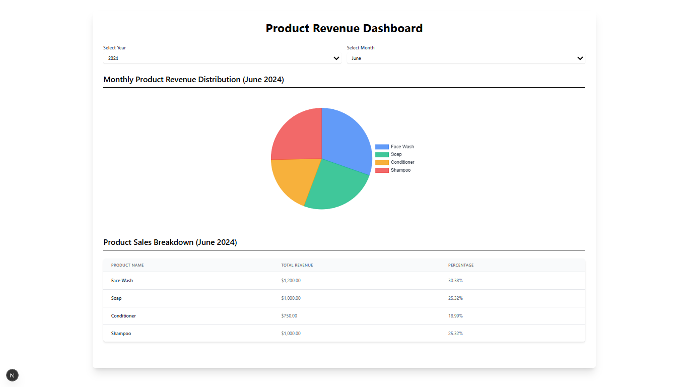

# 📊 Revenue Analytics Dashboard

A modern, responsive **Revenue Analytics Dashboard** built with **Next.js App Router**, **Tailwind CSS**, and **Node.js** backend. This app allows businesses to visualize product-wise revenue, filter by month/year, and gain actionable insights.

---

## 🚀 Features

* 📆 **Year & Month Selector** – Filter stats dynamically
* 📦 **Product-Based Revenue Breakdown** – View amounts, labels, and percentages
* 📈 **Interactive Dashboard** – Visual insights into business performance
* ⚙️ **Full Stack** – Frontend + Backend with MongoDB, Redis (Planned)
* 🧠 **Scalable Architecture** – Clean separation of client and server

---

## 🛠 Tech Stack

| Tech             | Description                              |
| ---------------- | ---------------------------------------- |
| **Next.js**      | React Framework with App Router (Client) |
| **Tailwind CSS** | Utility-first CSS framework              |
| **Node.js**      | Backend runtime                          |
| **Express.js**   | Backend API Framework                    |
| **MongoDB**      | Database for storing product & revenue   |
| **Redis**        | Caching layer (Planned)                  |

---

## 🧪 Setup & Run Locally

```bash
# 1. Clone the repository
git clone https://github.com/06-abhishek/revenue-analytics-dashboard.git
cd revenue-analytics-dashboard

# 2. Install & Run Frontend
cd client
npm install
npm run dev

# 3. Start Redis Server (IMPORTANT)
# Make sure Redis is installed and running before starting backend
# For Mac/Linux (with Homebrew):
brew services start redis

# For Windows (with Redis installed via MSI or Chocolatey):
redis-server

# 4. Install & Run Backend
cd ../server
npm install
npm start
```

---

## 🔐 Setup Environment Variables

Rename `.env.example` in the `server` folder to `.env` and fill in your credentials:

```env
MONGO_URI=your_mongodb_connection_string
```

---

## 📸 Preview

